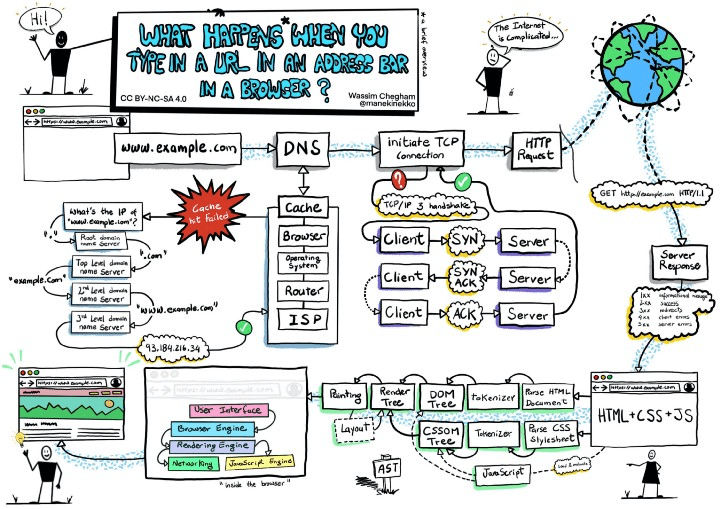

# Browser rendering

### 當你在瀏覽器輸入網址後，會發生什麼？

首先來張完整版的圖片

#### 一、首先我們要先了解瀏覽器的內部運作過程

大部分的瀏覽器都是多程序（multi-process）的架構，也就是說瀏覽器在運作時會由一個以上的 process 相互運作來完成任務，而 process 又做將工作分配給其下的執行緒（thread）來協助運作，其中 process 與 process 間是利用 IPC（inter-process communication）的方式來溝通。

而瀏覽器的 process 與渲染最有關係的是以下兩種：

1. browser process：主要負責瀏覽器功能，例如：網址列、書籤、送出網路請求等。
2. renderer process：主要負責網頁的顯示與渲染，例如 HTML 的解析。

因此當使用者在瀏覽器網址列輸入網址並送出後，主要會根據以下的流程完成

1. browser process 的 ui thread 接收到使用者輸入的資料（在網址列輸入網址），ui thread 會要求發出網路請求給 network thread。
2. browser process 的 network thread 開始建立連線，而當連線成功、資料傳輸完畢後，network thread 通知 ui thread 資料已準備好
3. browser process 利用 IPC 將資料傳遞給 render process 以進行頁面渲染。

#### 二、在發出網路請求時發生了什麼？

(ㄧ)、檢查 cache

透過 DNS 去取得實際 IP 資訊是一個耗時的過程，因此瀏覽器會先檢查 cache 中是否有相同的資料，如果有的話就可以省去 DNS lookup 的時間。
檢查 cache 的過程又分為以下順序：

- 瀏覽器 cache
- OS cache （作業系統快取，，會從作業系統的 Hosts 文件進行查找）
- router cache（路由器的快取）
- 檢查 ISP （Internet Service Provider） cache（網路供應商快取）

瀏覽器會依序去以上四個 cache 中檢查近期瀏覽、連接過的網站，看是否有相同的資料，如果有就不執行 DNS lookup，直接使用 cache 中的資料。

(二)、DNS lookup（域名解析）：

當使用者輸入網址後，瀏覽器會先將網址解析成 IP 位址以便取得網頁資料，而這個過程就是 DNS lookup，而 DNS lookup 會使用遞迴搜尋（recursive search）的方式來尋找我們需要的 domain，以  `https://www.google.com/` 為例，這個網址可以分為以下幾個部分來進行搜尋：

- Root domain 
- Top-level domain（.com）
- Second-level domain（google）
- Third-level domain（www）

在找到之後，就會將找到的 IP 位址回傳給瀏覽器，瀏覽器就可以開始建立連線。

(三)、建立連線

當瀏覽器取得 IP 位址後，就會開始建立連線，而建立連線的方式主要有以下幾個步驟：

- TCP（Transmission Control Protocol）：會經由三次握手（three handshake）的方式來建立連線，確保資料的正確性，TCP 連線建立完成後，就可以開始傳輸資料。
- HTTP Request：瀏覽器會發送一個 GET 的請求給 Web Server，請求成功後，則會將 HTML 回傳給瀏覽器進行解析。

#### 三、解析 HTML 的過程中發生了什麼？

(一)、 載入資料

瀏覽器對於 HTML 的頁面加載順序是由上而下。如果載入的檔案是外部連結則會另外發出另一個請求來獲取文件。當 CSS 檔案 以及 JavaScript 檔案載入結束後，則會進入到 render（渲染）的階段。

(二)、頁面渲染

頁面渲染的過程中會發生以下幾點事情：

- DOM
- CSSOM
- Render Tree
- Layout
- Paint

