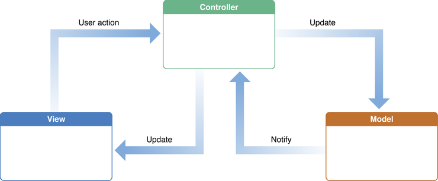
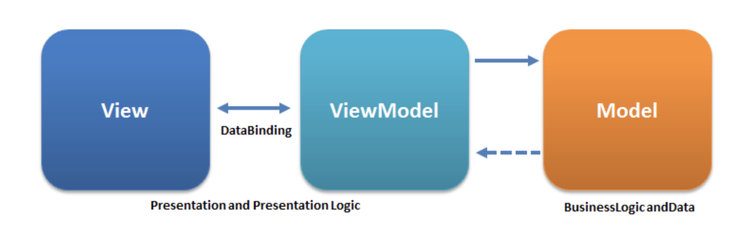

# MVC v.s MVVM

### 什麼是 MVC 架構？

- M：Model，負責資料的存取與處理、業務邏輯相關的資訊，像是數據操作、業務規則、資料驗證等
- V：View，負責顯示資料，幾乎沒有程式碼上的邏輯，有的話也只是讀取 Model 的資料，以及傳送事件給 Controller
- C：Controller，負責處理事件與其相關回應、控制應用程式的流程。事件主要有兩種，使用者的行為（View 所傳送的事件），以及 Model 的資料變化

#### 運作流程

使用者操作畫面時，View 接收事件交給 Controller，Controller 根據事件的請求內容選擇合適的 Modal 來處理資料，Model 處理完資料後再更新畫面。

#### 優點

- 關注點分離，每個部分都可以專注地處理自己該負責的事情。
- 降低程式碼的耦合度，提高程式碼的可讀性。因為每個部分只專注處理自己的部分，代表可以將應用程式拆分多個獨立的元件。在正確的情況下，這些元件可以個別在不同的情境被使用。
- 可擴展性
- 易於測試

#### 缺點

- 對小型應用而言，硬是將簡單的資料邏輯做簡單的資料邏輯做分層處理，反而增加了程式碼的複雜度
- 當應用程式隨著時間發展的越來越大，Controller 會負責太多事情，導致程式碼複雜

### 什麼是 MVVM 架構？

- M：Model，跟 MVC 的 Model 一樣，負責資料的存取與處理、業務邏輯相關的資訊，像是數據操作、業務規則、資料驗證等
- V：View，負責顯示資料
- VM：ViewModel，是 View 與 Model 之間的橋樑，負責將 Model 的資料轉換成 View 可以顯示的資料，以及將 View 的事件內容轉換成對 Model 的資料操作

#### 運作流程

使用者操作畫面時，View 會將事件交給 ViewModel，ViewModel 根據事件的請求內容選擇合適的 Modal 來處理資料，Model 處理完資料後將資料回傳給 ViewModal，最後 ViewModal 會將資料轉換成 View 可以使用的格式，並且自動更新 View （Data Binding）。

- 同一個 ViewModel 可以被多個 View 共享，從而提高了代碼的重用性和可擴展性
- 每個 View 都有對應的 ViewModel，因為 View 一定是透過 ViewModel 來自動更新畫面

#### 優點

- 相較於 MVC 會有更簡潔的程式碼，因為畫面的資料都是透過 ViewModel 自動更新。
- 關注點分離
- 降低程式碼的耦合度

#### 缺點

- 效能問題：Data Binding 雖然提供了撰寫程式碼時的方便性，但在大型的專案架構下很容易出現效能問題。
- 難以除錯：在某些情況下，當 Data Binding 發生錯誤或是 ViewModel 中的邏輯錯誤時，可能會導致排錯變得困難，因為會比較難以追蹤錯誤是從哪裡發生，雙向的資料流動也會增加排錯的難度。